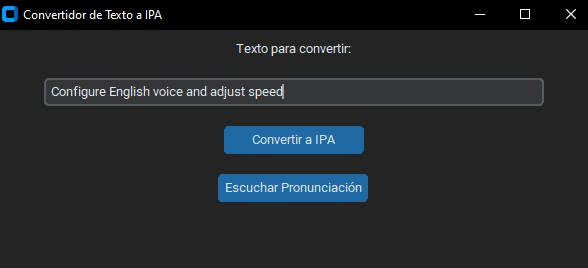
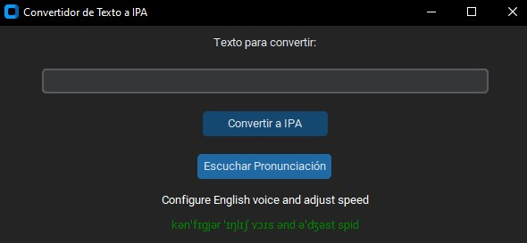

# 📘 Convertidor de Texto a IPA

**Convertidor de Texto a IPA** es una aplicación de escritorio liviana y fácil de usar desarrollada con Python y [CustomTkinter](https://github.com/TomSchimansky/CustomTkinter). Permite convertir texto en inglés a su transcripción en **AFI (Alfabeto Fonético Internacional)** y escuchar su pronunciación mediante un motor de texto a voz incorporado.

---

## 🌍 Idiomas disponibles

- 🇬🇧 [English Version](https://github.com/jorgevalega/text-to-ipa-converter)
- 🇧🇷 [Versão em Português](https://github.com/jorgevalega/conversor-de-texto-para-ipa)
- 🇪🇸 Español – *Estás aquí*

---

## 🚀 Funcionalidades

- ✅ Convierte texto en inglés a símbolos IPA
- 🔊 Escucha la pronunciación con el motor de texto a voz `pyttsx3`
- 🎨 Interfaz en modo oscuro con diseño moderno (CustomTkinter)
- 💡 Herramienta educativa para lingüística, fonética, estudiantes y docentes de inglés

---

## 📸 Captura de pantalla




---

## 🛠️ Instalación

### Requisitos

Asegúrate de tener **Python 3.8 o superior** instalado.

### 1. Clona el repositorio

```bash
git clone https://github.com/jorgevalega/convertidor-de-texto-a-ipa.git
cd convertidor-de-texto-a-ipa
```

### 2. Crea y activa un entorno virtual (recomendado)

```bash
python -m venv venv
source venv/bin/activate    # En Windows: venv\Scripts\activate
```

### 3. Instala las dependencias

```bash
pip install -r requirements.txt
```

---

## ▶️ Uso

Ejecuta la aplicación con:

```bash
python main.py
```

Luego escribe texto en inglés, haz clic en **Convertir a IPA**, y opcionalmente en **Escuchar Pronunciación** para oírla.

---

## 🧾 Dependencias

- `customtkinter`
- `eng_to_ipa`
- `pyttsx3`

Todas las dependencias están listadas en [`requirements.txt`](requirements.txt).

---

## 🧑‍💻 Autor

Desarrollado por [Jorge Valega](https://github.com/jorgevalega) – apasionado por la automatización, la accesibilidad y las herramientas de aprendizaje de idiomas.

---

## 📄 Licencia

Este proyecto está licenciado bajo la [Licencia MIT](LICENSE).

---

## ☕ Apoya el proyecto

Si te resulta útil, ¡déjale una ⭐ en GitHub o compártelo con otros!
